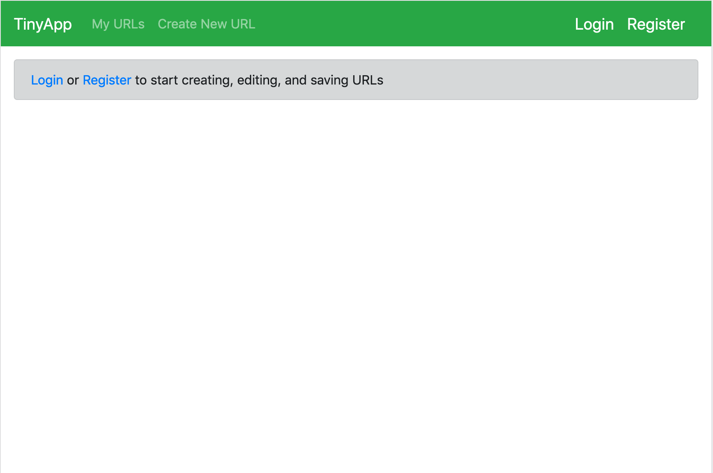
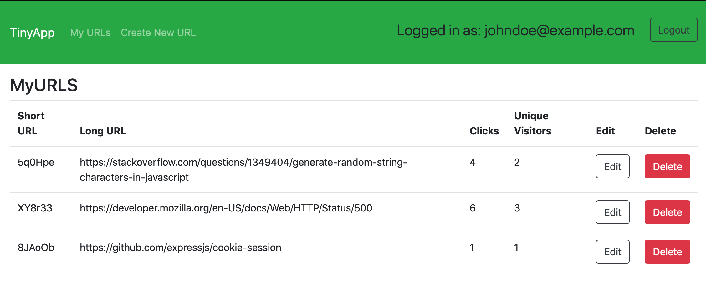

# TinyApp Project

TinyApp is a full stack web application built with Node and Express that allows users to shorten long URLs (à la bit.ly).

## Final Product

## Dependencies

- Node.js
- Express
- EJS
- bcrypt
- body-parser
- cookie-session

## Getting Started

- Install all dependencies (using the `npm install` command).
- Run the development web server using the `node express_server.js` command.

### New Features

- Counters that track how many times a URL has been visited, and by how many unique visitors

### Known Limitations / Future Considerations

- If a user navigates (via the address bar) to  `localhost:8080/urls/xxxxxx/delete` (using any shortened URL code in the place of the X's), the server will crash. Whether that code exists in the database or not. Users can delete a saved url by pressing the DELETE button on their main page.
- If a user navigates (via the address bar) to `localhost:8080/urls/xxxxxx` (using any shortened URL code in the place of the X's), but the URL code doesn't exist, some rudimentary html is sent. It can send the user back to the homepage. But the visuals could be improved.
- track each visit (with a timestamp), display on each URL's edit page
- Its not *that* apparent how to actually copy/paste the shortened URLs for use elsewhere.
- It is not entirely responsive.
- Email validation.
